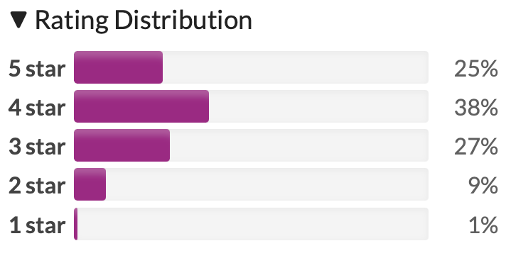

# BatteryBomb

Battery Bomb game for Unity

_Submission for the GMTK Game Jam 2026_

Plants can finally fight back against bugs with the power of…bombs? A game where time is your tower defense resource.

Time is your tower defense resource. Battery bombs charge your turrets and are moveable between turrets, but be careful; when the countdown hits 0, they explode, killing nearby enemies but also immobilizing your turret for the rest of the round.

## RESULTS

